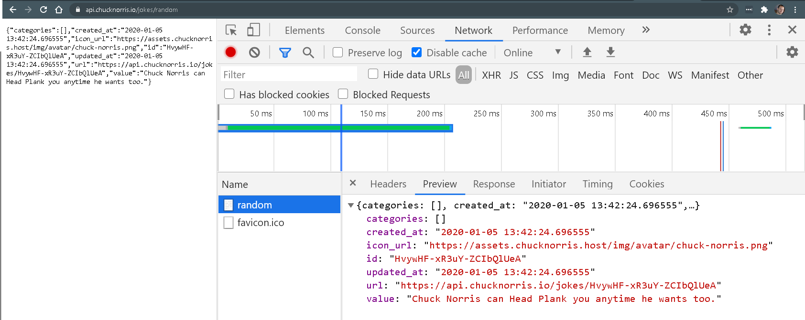

# Chistes random sobre Chuck Norris

Tenemos acceso a una API tal que, cada vez que la llamamos, nos devuelve un chiste aleatorio sobre Chuck Norris.
Aquí tienes una [Demo](https://js-beginners.github.io/random-joke-api-project/).

Puedes probar simplemente invoncando a la API desde el [navegador](https://api.chucknorris.io/jokes/random)

Fíjate en el formato que devuelve los datos cada vez que la invocas. Para ver mejor la estructura de los datos, puedes inspeccionar las llamadas que hace el script del 
lado cliente al servidor.

## Requisitos

1. Implementa el mismo comportamiento de la demo, tal que cada vez que hagas clic en el botón __Get Joke!__ recupere un chiste aleatorio de la API https://api.chucknorris.io/jokes/random y lo muestre en el elemento del DOM adecuado
2. Investiga como podrias hacerlo para que, en el caso que ocurriera algún error en la llamada AJAX, se mostrará un mensaje error en el mismo contenedor; informando al usuario que algo ha ido mal. Puedes simular dicho comportamiento por ejemplo, cambiando la URL de la API a una dirección que no exista.

## Otras soluciones

[Claudia Ballano](https://github.com/claudiaballano/random-joke-api-project)
